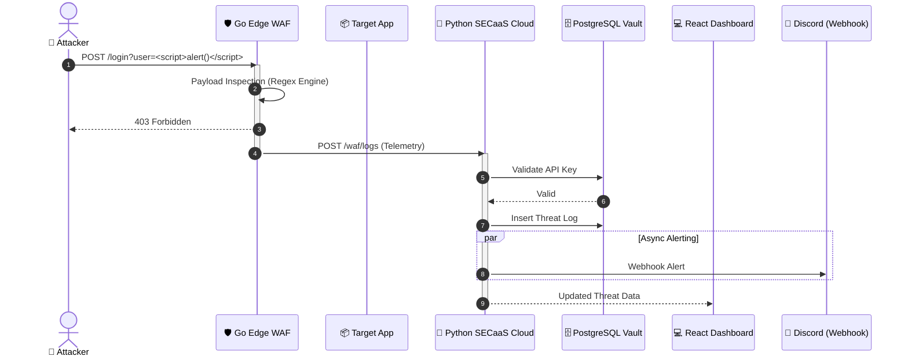
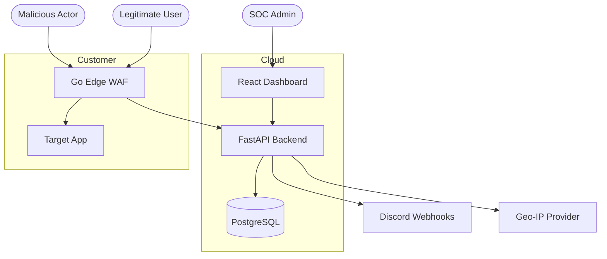

# 🛡️ WolfGuard 360 | Enterprise SECaaS & Edge WAF


---

## 🚀 Overview

**WolfGuard 360** is a fully containerized, enterprise-grade **Security-as-a-Service (SECaaS)** platform engineered for modern DevSecOps environments. It combines a high-performance **Edge Web Application Firewall (WAF)** with a centralized cloud control plane and a real-time SOC dashboard.

The system is designed for **low-latency threat mitigation**, **multi-tenant scalability**, and **real-time security observability**.

---

## 🏗️ Core Architecture

WolfGuard 360 follows a **microservices-based architecture**, orchestrated via Docker for seamless scalability and deployment.

### 🔹 Edge Engine (Golang)

* High-performance reverse proxy WAF
* Real-time inspection of HTTP traffic
* Detects and blocks:

  * Cross-Site Scripting (XSS)
  * SQL Injection (SQLi)
  * Path Traversal
* Ensures only sanitized traffic reaches backend services

### 🔹 SECaaS Cloud (Python / FastAPI)

* Central intelligence and control layer
* Handles:

  * Multi-tenant JWT authentication
  * Secure API key generation
  * Asynchronous telemetry ingestion
* Acts as the orchestration brain of the platform

### 🔹 Relational Vault (PostgreSQL)

* Strongly structured persistence layer
* Features:

  * Tenant isolation
  * Target configuration storage
  * Immutable threat logs

### 🔹 Command Cockpit (React + Vite + Tailwind)

* Real-time SOC dashboard
* Features:

  * Live threat feed
  * Agent management
  * Dark-mode UI optimized for monitoring

---

## ✨ Enterprise Features

* **Real-Time Threat Telemetry**

  * Sub-second visibility of blocked attacks in the SOC dashboard

* **Instant API Key Revocation**

  * Immediate shutdown of compromised edge agents

* **Automated DevSecOps Alerting**

  * Critical events pushed to Discord webhooks

* **Global Oversight ("God Mode")**

  * Geo-IP tracking of active nodes using fallback strategies

* **Zero-Friction Deployment**

  * Entire system boots with a single Docker Compose command

---

## 🚀 Quickstart (Local Deployment)

### Prerequisites

* Docker
* Docker Compose

---

### 1. Clone Repository

```bash
git clone https://github.com/pugazh342/WolfGuard-360.git
cd WolfGuard-360
```

### 2. Launch Infrastructure

```bash
docker-compose up --build -d
```

### 3. Access Dashboard

```
http://localhost:5173
```

### 🔐 Default Admin Credentials

```
Username: admin
Password: wolfguard2026
```

---

## 🔄 Threat Lifecycle (Sequence Workflow)



---

## 🗺️ System Topology



---

## 📖 Deployment Workflow

1. **Register Target**

   * Add your application URL in the dashboard

2. **Generate API Key**

   * Securely copy the issued `WG_API_KEY`

3. **Deploy WAF Agent**

   * Run the Golang container with:

     * Target URL
     * API Key

4. **Validate Protection**

   * Simulate an attack:

     ```
     http://localhost:8080/?q=<script>
     ```
   * Confirm:

     * Request blocked
     * Logs appear in dashboard

---

## 🧠 Engineering Highlights

* Fully containerized microservices architecture
* Real-time distributed telemetry pipeline
* Secure multi-tenant SaaS design
* Edge-first security enforcement
* DevSecOps-ready alerting system

---

## 📌 Use Cases

* SaaS platform protection
* API gateway security layer
* DevSecOps monitoring pipelines
* Enterprise perimeter defense simulation
* Security research & demonstration

---

## 🏁 Conclusion

**WolfGuard 360** is engineered to demonstrate **production-grade DevSecOps practices**, combining **edge security enforcement**, **cloud intelligence**, and **real-time observability** into a cohesive, scalable platform.

---
