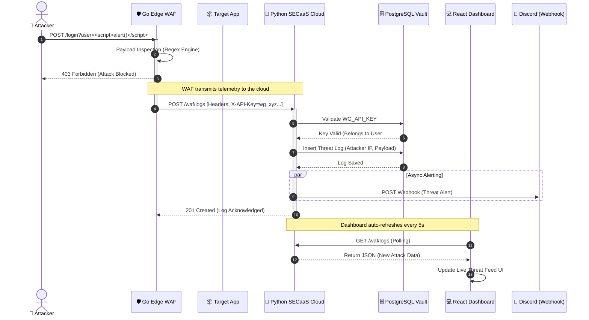

# 🛡️ WolfGuard 360 | Security-as-a-Service (SECaaS)


WolfGuard 360 is a fully containerized, enterprise-grade Security-as-a-Service (SECaaS) platform. It features a high-performance Web Application Firewall (WAF) deployed at the edge, managed by a centralized cloud control plane, and monitored via a real-time Security Operations Center (SOC) dashboard.

## 🏗️ Architecture

The platform is built on a modern microservices architecture, entirely orchestrated via Docker:

1. **The Edge Engine (Go):** A lightning-fast reverse proxy WAF that intercepts HTTP traffic, inspects payloads for malicious signatures (XSS, SQLi), blocks threats, and routes safe traffic to the target application.
2. **The SECaaS Cloud (Python/FastAPI):** The central brain of the operation. It manages multi-tenant JWT authentication, generates cryptographically secure API keys, and processes incoming threat telemetry.
3. **The Relational Vault (PostgreSQL):** A strictly structured database keeping customer configurations, active target URLs, and attack logs completely isolated.
4. **The Command Cockpit (React/Vite/Tailwind):** A sleek, dark-mode dashboard for users to register targets, copy deployment keys, and watch live threat intelligence feeds.

## ✨ Key Features

* **Real-Time Threat Intelligence:** As the Go Agent blocks attacks at the edge, logs are instantly pushed to the React dashboard via the Python API without requiring a page refresh.
* **Instant API Key Kill Switches:** Users can permanently revoke compromised WAF API keys directly from their inventory, instantly locking out unauthorized agents.
* **Live Discord Alerting:** Critical threat interceptions can be optionally routed to Discord webhooks for instant DevOps notification.
* **God Mode Oversight:** A hidden administrative dashboard featuring real-time Geo-IP tracking (via IP fallback algorithms) to monitor the global location of active SECaaS customers.
* **1-Click Deployment:** The entire company infrastructure boots simultaneously using Docker Compose.

## 🚀 Quickstart (1-Click Deploy)

Ensure you have [Docker](https://www.docker.com/) and Docker Compose installed.

1. Clone the repository:
   ```bash
   git clone https://github.com/pugazh342/WolfGuard-360.git
   cd WolfGuard-360
   ```
2. Launch the entire platform:
```bash
docker-compose up --build -d
```
Access the SOC Dashboard:
Navigate to `http://localhost:5173` in your browser.

Default Admin Credentials:

Username: `admin``

Password: `wolfguard2026`

## Workflow
This sequence diagram shows the step-by-step lifecycle of what happens when a hacker tries to attack a protected application, and how your platform handles it in real-time.

 ## Architecture Diagram 
 ``` mermaid
graph TD
    %% Define Styling
    classDef frontend fill:#20232A,stroke:#61DAFB,stroke-width:2px,color:#fff;
    classDef backend fill:#3776AB,stroke:#FFD43B,stroke-width:2px,color:#fff;
    classDef database fill:#316192,stroke:#fff,stroke-width:2px,color:#fff;
    classDef waf fill:#00ADD8,stroke:#fff,stroke-width:2px,color:#fff;
    classDef external fill:#2C2F33,stroke:#7289DA,stroke-width:2px,color:#fff;
    classDef target fill:#198754,stroke:#fff,stroke-width:2px,color:#fff;

    %% External Actors
    Admin([👨‍💻 SOC Admin])
    Attacker([🥷 Malicious Actor])
    LegitUser([👤 Legitimate User])

    %% Components
    subgraph "WolfGuard 360 SECaaS Cloud"
        UI["💻 React Command Cockpit<br/>(Port: 5173)"]:::frontend
        API["🧠 Python FastAPI Brain<br/>(Port: 8000)"]:::backend
        DB[("🗄️ PostgreSQL Vault<br/>(Port: 5432)")]:::database
    end

    subgraph "Customer Environment"
        WAF{"🛡️ Go Edge WAF<br/>(Port: 8080)"}:::waf
        App["📦 Target Application"]:::target
    end

    %% Third Party
    Discord["💬 Discord Webhooks"]:::external
    GeoIP["🌍 Geo-IP Provider<br/>(ipinfo.io)"]:::external

    %% Connections
    Admin -- "JWT Auth / Dashboard" --> UI
    UI -- "REST API (JSON)" --> API
    API -- "SQLAlchemy ORM" --> DB
    API -- "Async Threat Alerts" --> Discord
    API -- "Fetch Admin Location" --> GeoIP
    
    Attacker -- "HTTP Exploit (XSS/SQLi)" --> WAF
    LegitUser -- "Clean HTTP Request" --> WAF
    
    WAF -- "403 Forbidden / Drop" --> Attacker
    WAF -- "Reverse Proxy" --> App
    WAF -- "Telemetry (WG_API_KEY)" --> API
```

## 📖 User Flow
Register a Target: Log into the React dashboard and register the URL of the application you want to protect.

Deploy the Agent: Copy the generated `WG_API_KEY`.

Engage the WAF: Run the Go WAF container, passing your API Key and Target URL as environment variables.

Monitor the Perimeter: Fire an attack (e.g., `http://localhost:8080/?q=<script>`) and watch it get intercepted by the WAF and instantly logged on your Threat Feed.

## 📸 Interface Preview

* Built as a comprehensive demonstration of Full-Stack Security Engineering, DevSecOps, and Microservice Architecture.

